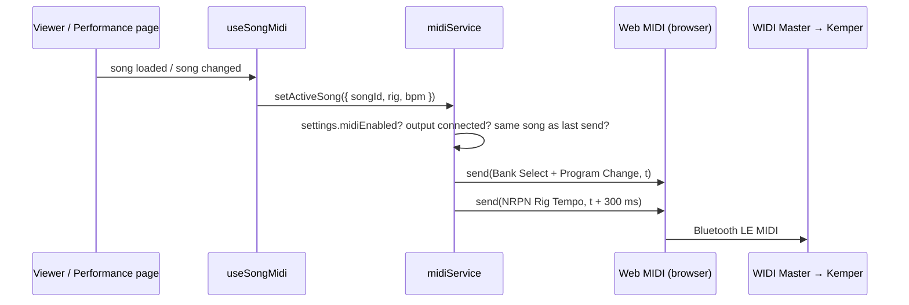

# MIDI out — Kemper Profiler rig & tempo

When a song is opened in the Viewer or in Performance mode, ChordCrew can switch a
**Kemper Profiler** (developed for the Profiler Stage) to the song's rig and tempo over
MIDI, e.g. via a **CME WIDI Master** Bluetooth MIDI adapter plugged into the Kemper's
MIDI In.

Requirements: [REQ-MIDI in `requirements.md`](requirements.md#req-midi--midi-out-kemper-profiler) ·
Decisions: [decision log in `roadmap.md`](roadmap.md#decision-log) · Code: `src/midi/`

> **Status:** implemented and tested against a mocked Web MIDI device. **Not yet verified
> on real hardware** — see [Hardware test checklist](#hardware-test-checklist) and
> [open points](#8-known-limitations--open-points).

---

## 1. Overview



- **Per song** (in the ChordPro content, synced with the song): the rig and the tempo.
- **Per device** (local settings row, never synced): on/off, MIDI output, channel, tempo mode.
- Works wherever the browser implements the Web MIDI API (Chrome/Edge on Android, macOS,
  Windows). **Safari on iPad/iPhone has no Web MIDI** — there the feature is a silent no-op.

## 2. Song data

| What | ChordPro | Stored as | Notes |
|------|----------|-----------|-------|
| Rig | `{x_kemper_rig: 17}` | song content, read by `extractMeta().kemperRig` | Program Change 17 (1–128, as numbered on the Kemper) |
| Rig | `{x_kemper_rig: 6.2}` | same | Performance 6, Slot 2 (Performance Mode); `6/2` also accepted |
| Tempo | `{tempo: 120}` | `transcription.tempo` (existing) | Same value the metronome uses; no new field |

`x_` directives are the ChordPro convention for custom extensions; chordsheetjs keeps the
value as metadata and renders nothing, so the directive is invisible in the Viewer, in PDFs
and in other ChordPro tools.

When MIDI is enabled in Settings, the editor's first metadata row shows a **Rig** field that
writes the directive and shows how it is read ("PC 17", "Perf 6 · Slot 2" or "invalid").

## 3. MIDI messages

All messages go to the configured channel `n` (1–16; status byte low nibble = `n − 1`).
The Kemper listens on its *MIDI Global Channel*, **Omni by default**, so channel 1 works
out of the box. Builders: `src/midi/kemper.ts` (pure functions, unit-tested).

### 3.1 Rig

| Notation | Bytes (channel 1) | Meaning |
|----------|-------------------|---------|
| `17` | `C0 10` | Program Change, value = number − 1 |
| `6.2` | `B0 00 00` · `B0 20 00` · `C0 1A` | Bank Select MSB 0, Bank Select LSB 0, Program Change 26 |
| `26.4` | `B0 00 00` · `B0 20 01` · `C0 00` | first slot of bank 1 |

Performance Mode addresses 125 performances × 5 slots = 625 slots as one running index:

```
index   = (performance − 1) × 5 + (slot − 1)
bank    = floor(index / 128)      → CC 32 (Bank Select LSB); CC 0 (MSB) is always 0
program = index mod 128           → Program Change
```

Example from the Kemper forum: "PC #27 loads Performance 6 Slot 2" → index 26 ✔.
Performance 26 Slot 3 is the last slot of bank 0 (index 127).

In **Browser Mode** a Program Change only loads a rig after that PC number has been assigned
to the rig on the Kemper (System Settings → page *Browser Mode PrgChg* → *Assign*).

### 3.2 Tempo — "Exact" (default): NRPN Rig Tempo

The Kemper exposes the rig tempo as NRPN parameter **address page 4, parameter 0**
(*Rig Settings → Tempo*). NRPN = four standard controllers; the value is applied when
CC 38 arrives. Raw value = **BPM × 64** (14 bit, so up to 255 BPM).

| Step | Bytes (ch 1, 120 BPM) | |
|------|-----------------------|-|
| CC 99 = 4 | `B0 63 04` | NRPN address MSB (page 4 = Rig) |
| CC 98 = 0 | `B0 62 00` | NRPN address LSB (param 0 = Tempo) |
| CC 6 = 60 | `B0 06 3C` | value MSB (7680 >> 7) |
| CC 38 = 0 | `B0 26 00` | value LSB (7680 & 0x7F) → applied |
| CC 99 = 127, CC 98 = 127 | `B0 63 7F` `B0 62 7F` | "NRPN null": the Kemper keeps the last address, so this stops later data-entry CCs from changing the tempo |

Valid range sent: 20–255 BPM; songs without `{tempo}` send no tempo.

### 3.3 Tempo — "Tap" (fallback)

Four Tap Tempo presses one beat apart: `B0 1E 00` (CC 30, value 0) at `0, 1, 2, 3 × 60000/BPM` ms.
Value 0 is the Kemper's single-event tap; value 1 is a "press" that starts the Beat Scanner
if no release follows within 3 s. Less precise than NRPN (each tap is subject to Bluetooth
latency jitter), kept in case NRPN does not work on a given firmware.

### 3.4 Order and timing

1. Rig at *t*.
2. Tempo at *t* + **300 ms** (only when a rig was sent), so a tempo stored in the rig
   ("Tempo Enable") is loaded first and then overridden by the song tempo.

Messages carry Web MIDI **timestamps** (`MIDIOutput.send(data, timestamp)`), so the browser
times them even while the main thread is busy rendering the new song. Each song's messages
are queued behind the previous song's, so tap sequences never interleave when songs are
flipped quickly.

MIDI clock is deliberately **not** used: it would need a continuous 24-ppq stream and
jitters over Bluetooth MIDI.

## 4. Implementation

| File | Responsibility |
|------|----------------|
| `src/midi/kemper.ts` | Pure builders: `parseKemperRig`, `formatKemperRig`, `rigMessages`, `tempoNrpnMessages`, `tapTempoMessages`, `buildSongMidi` (order + delays). No browser APIs. |
| `src/midi/midiService.ts` | Web MIDI wrapper: `isMidiSupported`, `getMidiAccess(interactive)`, `listOutputs`, `onMidiPortsChanged`, `setActiveSong`, `sendMidiTest`. Holds the only mutable state (access, active song, last sent song, send queue). |
| `src/midi/useSongMidi.ts` | React hook used by `ViewerPage` and `PerformancePage`: derives `{ songId, rig, bpm }` and calls `setActiveSong` on song change / `null` on leave. |
| `src/components/midi/MidiSettingsSection.tsx` | Settings → *MIDI · Kemper Profiler*: switch, output, channel, tempo mode, test sender; explanation on browsers without Web MIDI. |
| `src/pages/EditorPage.tsx` | Rig field in the metadata bar (only while MIDI is enabled). |
| `src/utils/chordpro.ts` | `extractMeta()` reads `{x_kemper_rig}` into `kemperRig`. |
| `src/types.ts` | `AppSettings.midiEnabled / midiOutputId / midiOutputName / midiChannel / midiTempoMode` + defaults. |

### Runtime behaviour

- **Permission.** `getMidiAccess(true)` — the only call that may show the browser's MIDI
  permission prompt — is used only by Settings (switching MIDI on, *Test*). Song pages call
  `getMidiAccess(false)`, which first checks `navigator.permissions.query({ name: 'midi' })`
  and gives up on `prompt`/`denied`. No prompt can appear on stage.
- **Output lookup.** By stored port id, falling back to the stored port name (browsers may
  assign a new id to a Bluetooth device after re-pairing). Only ports in state `connected`
  are used.
- **When it sends.** On song change in Viewer and Performance mode. The same song is not sent
  twice in a row (e.g. Viewer → *Present*); a changed rig, tempo, output, channel or tempo
  mode counts as a change.
- **Late devices.** If no output is connected when the song opens (Kemper still booting,
  Bluetooth reconnecting), the service sends the current song as soon as a MIDI output
  connects. After an output disconnects, the current song is sent again on reconnect.
- **Stage safety.** The send path shows no UI or toasts, makes no network calls and swallows
  every error; unsupported browsers return before touching IndexedDB. MIDI is local I/O, so
  the project's "no automatic sync" rule is unaffected.
- **Security headers.** Web MIDI needs no CSP change. The production `Permissions-Policy`
  header does not list `midi`, so the default allowlist (`self`) applies.

### Settings (per device)

| Field | Default | UI |
|-------|---------|----|
| `midiEnabled` | `false` | *Send MIDI on song change* |
| `midiOutputId`, `midiOutputName` | `''` | *Output* (auto-selects a port named "WIDI…"/"Kemper…" when MIDI is switched on) |
| `midiChannel` | `1` | *MIDI channel* |
| `midiTempoMode` | `'nrpn'` | *Tempo*: Exact / Tap / Off |

## 5. Platform support & setup

| Platform | Web MIDI | WIDI Master setup |
|----------|----------|-------------------|
| Android (Chrome, Edge) | ✅ | Bluetooth MIDI devices are usually not visible to Chrome by default; connect the WIDI first with a BLE-MIDI bridge app (e.g. *MIDI BLE Connect*) or CME's *WIDI App*, then pick it in Settings → MIDI. |
| macOS (Chrome, Edge) | ✅ | *Audio MIDI Setup* → *Window → Show MIDI Studio* → Bluetooth icon → *Connect* next to the WIDI Master (no automatic pairing on macOS). |
| Windows (Chrome, Edge) | ✅ API | Not verified with a Bluetooth MIDI device. |
| iPad / iPhone (Safari and every iOS browser, all WebKit) | ❌ | Not possible in the PWA. The third-party *Web MIDI Browser* app adds Web MIDI to iOS, but it has its own storage (sync your library first) and Google sign-in in embedded browsers may be blocked — untested. |

## 6. Testing

- **Unit** (`npm run test:unit`): `src/midi/kemper.test.ts` — rig parsing, PC and bank/slot
  mapping incl. bank boundaries, NRPN bytes for 120 and 93 BPM, tap schedule, order/delays,
  `extractMeta().kemperRig`.
- **E2E** (`npm test`, chromium in CI): `tests/midi.spec.ts` replaces `navigator.requestMIDIAccess`
  with a fake "WIDI Master" output that records every `send(data, timestamp)`:
  - MIDI-1 Performance mode sends Bank/PC, then the NRPN tempo 300 ms later
  - MIDI-2 next setlist song sends its own rig + tempo
  - MIDI-3 Viewer → Present on the same song sends only once
  - MIDI-4 nothing is sent while MIDI is disabled
  - MIDI-5 Settings: enabling auto-selects the WIDI output; *Test* sends
  - MIDI-6 browsers without Web MIDI get an explanation instead of controls
  - MIDI-7/8 editor Rig field writes `{x_kemper_rig}`; hidden while MIDI is off

### Hardware test checklist

1. Kemper: *System Settings → MIDI*: Global Channel = Omni (or set the same channel in ChordCrew).
2. Pair the WIDI Master with the tablet/computer (see §5).
3. ChordCrew → Settings → MIDI: switch on, allow MIDI, select the WIDI output.
4. *Test* with BPM 100 and no rig → the Kemper's tempo must read **100**.
   If it shows a different value, the ×64 scale is wrong for this firmware → switch Tempo to
   *Tap* and report the value shown.
5. *Test* with a rig: Performance Mode `1.1`, `6.2`, `27.1` (bank 1); Browser Mode: a PC number
   assigned on the Kemper first.
6. A rig with a stored tempo ("Tempo Enable" on): after opening a song, the song tempo must win.
7. Performance mode with a setlist: flip songs with the pedal; rig and tempo follow each song.
8. Switch the Kemper off and on while a song is open: the song's rig/tempo are sent again once
   the WIDI reconnects.

## 7. Decisions and alternatives

The original task prompt proposed new song fields `midiProgramChange` and `bpm`, a
`MidiService` with `sendTapTempo`, and four tap impulses on CC 30. Deviations:

| Proposal | Chosen | Why |
|----------|--------|-----|
| New `bpm` field | existing `{tempo}` | Tempo already exists (metronome, tap button, imports, CSV); a second field would drift. |
| New `midiProgramChange` field | `{x_kemper_rig}` directive | Same pattern as `{tempo}`/`{key}`: syncs, backs up and edits with the song — no Dexie schema, sync or Firestore-rules change. |
| PC number only | PC number **or** Performance.Slot | Profiler Stage users usually work in Performance Mode; slot → bank/PC is computed. |
| 4 × Tap Tempo (CC 30) | NRPN Rig Tempo, tap as fallback | NRPN sets the exact BPM with one message; taps inherit Bluetooth jitter. |
| MIDI clock | not used | Needs a continuous stream; jitters over Bluetooth. |
| SysEx | not used | Would require the extra `sysex` permission; NRPN via plain CCs reaches the same parameter. |
| Rig per musician | rig per song | A per-user store (like song notes) needs a new table, sync path and Firestore rules. Revisit if several players with different rigs share team songs. |

## 8. Known limitations / open points

- **×64 tempo scale is inferred, not documented by Kemper.** The MIDI Parameter Documentation
  names the parameter (page 4, param 0 "Tempo bpm") but not its scale. ×64 is corroborated by
  PySwitch's Kemper client (`bpm = value / 64`) and by a Kemper-forum SysEx example that sets
  120 BPM with value `3B 7F` (= 7679 ≈ 120 × 64). A second, quoted *response* value in the
  same forum summary (`13 10`) does not fit and could not be checked (see Sources). → Verify
  with step 4 of the hardware checklist.
- **No iOS support** (no Web MIDI in WebKit).
- **Rig is per song, not per musician** (see §7).
- Re-opening a different song and coming back re-sends the rig: the Kemper reloads it, which
  discards manual changes made on the Kemper in between.
- Linked song copies: adding `{x_kemper_rig}` changes the content, so linked copies show as
  diverged until synced (same as any other content edit).

## 9. Sources

Access notes: *read* = the document or code was read directly during development;
*summary* = only a search-engine summary was available, because `kemper-amps.com`,
`forum.kemper-amps.com` and some mirrors were blocked by the build environment's network proxy.

### Kemper Profiler

| Source | Used for | Access |
|--------|----------|--------|
| [KEMPER PROFILER MIDI Parameter Documentation 11 (PDF, copy on the Morningstar forum CDN)](https://cdck-file-uploads-canada1.s3.dualstack.ca-central-1.amazonaws.com/flex030/uploads/morningstar/original/2X/8/85a1d36b29f40d92b55b590c76c9b5b1ee1847b1.pdf) | CC 30 tap semantics (value 0 = single-event tap, value 1 → Beat Scanner after 3 s); CC 47–54 (Performance/slot select); NRPN structure CC 99/98/6/38, value applied on CC 38, address kept; Rig Settings page 4: 0 = Tempo, 2 = Tempo Enable; Global Channel default Omni; SysEx single-parameter format | read |
| [PySwitch — Kemper client, `mappings/tempo_bpm.py` and `mappings/tempo.py` (GitHub, Tunetown/PySwitch)](https://github.com/Tunetown/PySwitch) | Rig Tempo at NRPN page `0x04` / param `0x00`; display conversion `round(value / 64)` → ×64 scale; Tap Tempo = CC 30. GPL-licensed — used as reference only, no code copied. | read |
| [Kemper Forum — PySwitch thread, page 11](https://forum.kemper-amps.com/forum/thread/65206-pyswitch-firmware-for-paintaudio-midi-captain/?pageNo=11) | SysEx example "set 120 BPM": `F0 00 20 33 02 7F 01 00 04 00 3B 7F F7` | summary |
| [Kemper Forum — MIDI program change in performance mode](https://forum.kemper-amps.com/forum/thread/34692-midi-program-change-in-performance-mode/) and [MIDI Program Changes To Kemper Performance](https://forum.kemper-amps.com/forum/thread/58902-midi-program-changes-to-kemper-performance/) | 625 slots via Bank Select LSB + PC; PC #27 → Performance 6 Slot 2; bank 0 ends at Performance 26 Slot 3; MSB not needed | summary |
| [Kemper Forum — Midi → TAP tempo](https://forum.kemper-amps.com/forum/thread/4020-midi-tap-tempo/) | Press = 1 / release = 0; single event → value 0 (matches the PDF) | summary |
| [Kemper Profiler Main Manual — MIDI Program Change Assignments (ManualsLib p. 244)](https://www.manualslib.com/manual/1984887/Kemper-Profiler.html?page=244) and [Rig Change in Browser Mode (p. 274)](https://www.manualslib.com/manual/1984887/Kemper-Profiler.html?page=274) | Browser Mode: PC numbers must be assigned to rigs on page *Browser Mode PrgChg* | summary |
| [pencilresearch/midi — PR #303 "Add Kemper Profiler Stage"](https://github.com/pencilresearch/midi/pull/303) | Cross-check: Stage uses CC 0/32 + CC 47–54 and 14-bit NRPN via CC 6/38/98/99 | read |

### Web MIDI and platforms

| Source | Used for | Access |
|--------|----------|--------|
| [MDN — `Navigator.requestMIDIAccess()`](https://developer.mozilla.org/docs/Web/API/Navigator/requestMIDIAccess) and [`MIDIOutput.send()`](https://developer.mozilla.org/docs/Web/API/MIDIOutput/send) | API shape; `send(data, timestamp)` for browser-timed delivery | read (via TypeScript DOM typings) |
| [Super Simple Piano — "Web MIDI in 2026: Which Browsers Actually Work"](https://www.supersimplepiano.com/blog/web-midi-browser-compatibility-2026) | No Web MIDI in Safari on iOS/iPadOS; every iOS browser uses WebKit | summary |
| [Hacker News — Apple declined to implement 16 Web APIs](https://news.ycombinator.com/item?id=23676109) | Background: Web MIDI declined for fingerprinting reasons | summary |
| [Web MIDI Browser (App Store)](https://apps.apple.com/us/app/web-midi-browser/id953846217) | Possible iOS workaround (untested) | summary |

### CME WIDI Master

| Source | Used for | Access |
|--------|----------|--------|
| [WIDI Master Owner's Manual V08 (PDF)](https://www.cme-pro.com/wp-content/uploads/2025/05/WIDI-Master-user-manual_English_v08.pdf) and [WIDI Master Start Guide](https://www.cme-pro.com/widi-master-start-guide-bluetooth-midi/) | macOS pairing via Audio MIDI Setup → MIDI Studio → Bluetooth → Connect; no automatic pairing on macOS | summary |
| [WIDI Master Owner's Manual — Connect with Android device (ManualsLib p. 7)](https://www.manualslib.com/manual/1893682/Cme-Widi-Master.html?page=7) and [WIDI Master product page](https://www.cme-pro.com/widi-master/) | Android: a BLE-MIDI bridge app (or CME's WIDI App) connects the device for other apps | summary |
